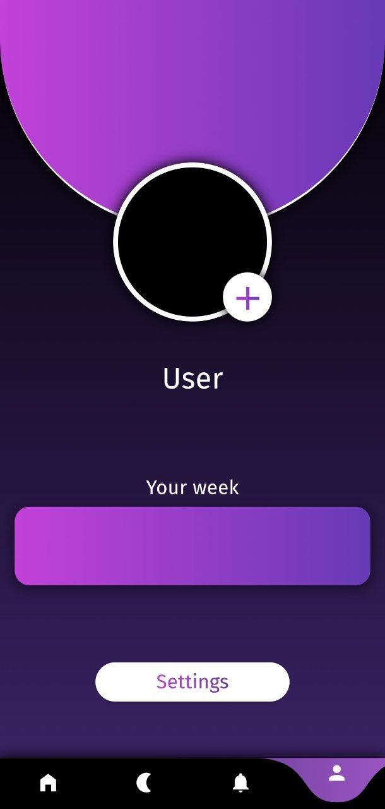
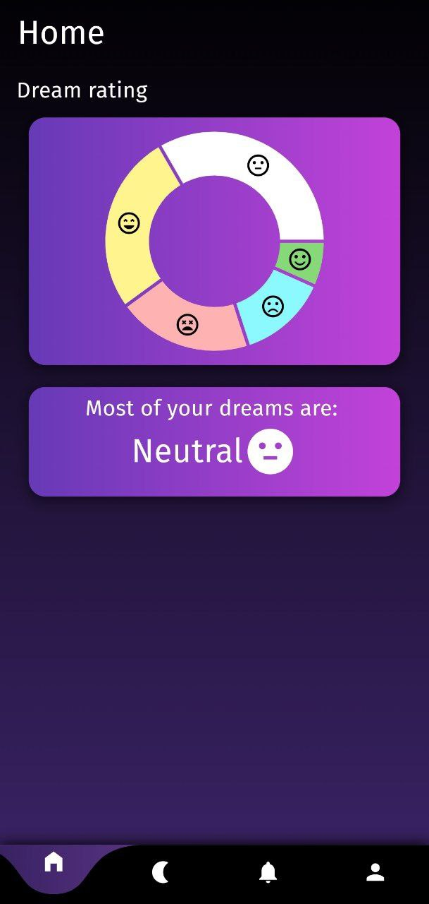
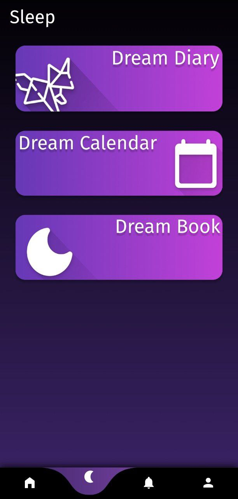
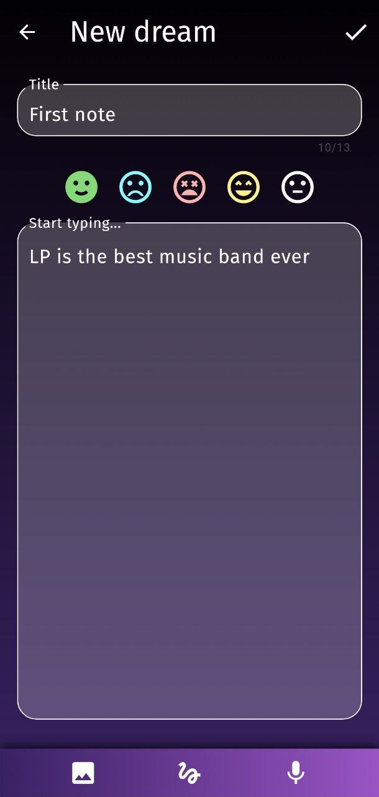
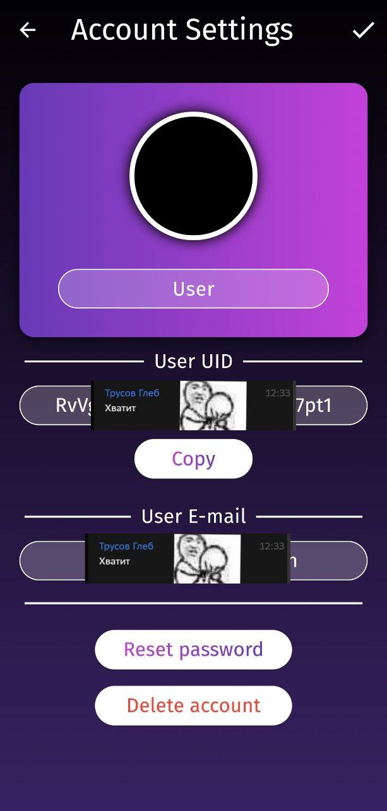
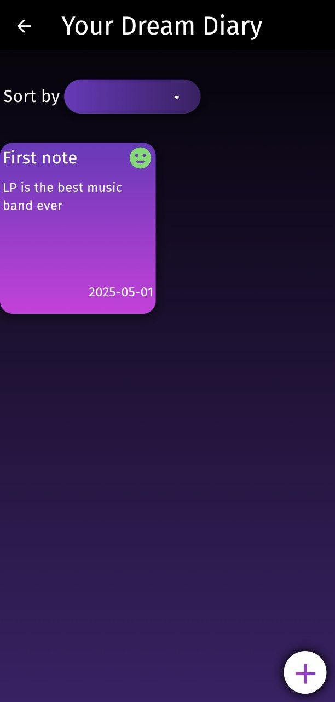
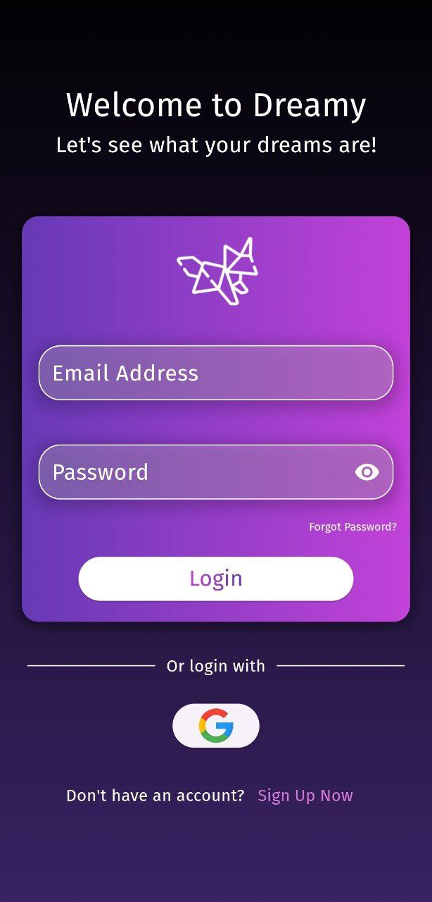
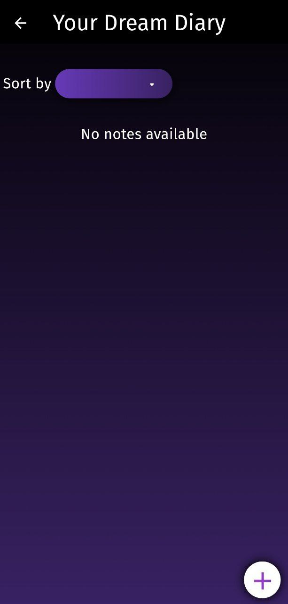
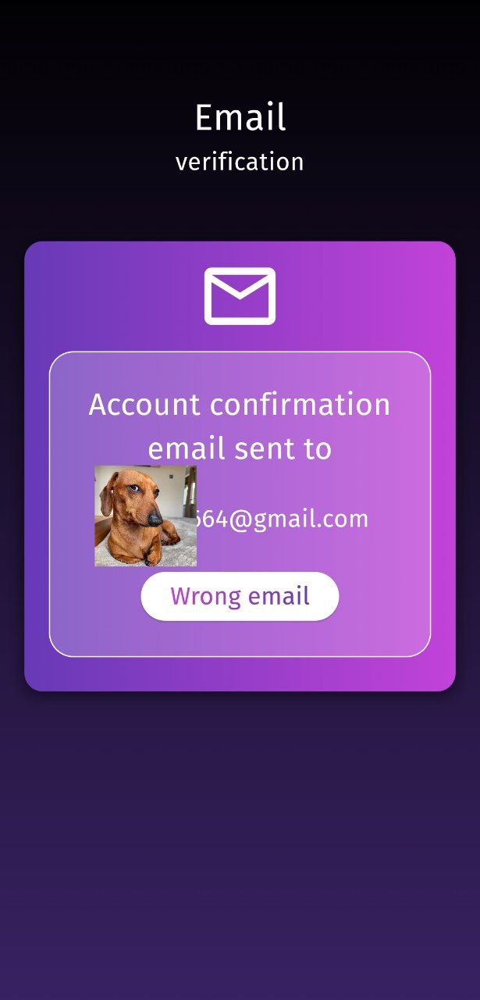
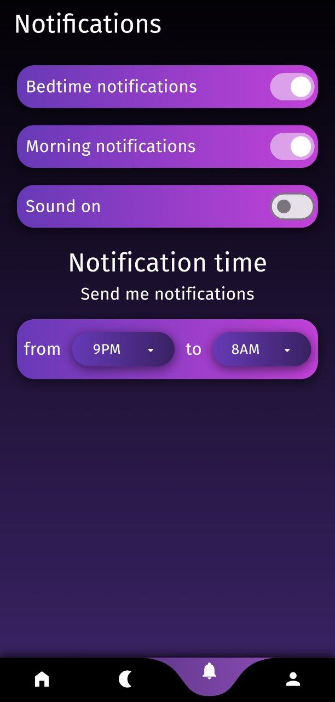

# Dreamy project

The project is an application for writing dreams and tracking the user emotional state from them

## Used technologies
- Dart
- Flutter
- Firebase
## [Figma Layout](https://www.figma.com/design/NF6roHLK0jbjECEbPn7UfC/Dreamy?t=SwkhzzkdA2Qbfxhw-0)

## Used Flutter Packages
- [firebase_core: ^3.4.1](https://pub.dev/packages/firebase_core)
- [firebase_auth: ^5.2.1](https://pub.dev/packages/firebase_auth)
- [firebase_database: ^11.1.4](https://pub.dev/packages/firebase_database)
- [intl: ^0.19.0](https://pub.dev/packages/intl)
- [cupertino_icons: ^1.0.2](https://pub.dev/packages/cupertino_icons)
- [material_design_icons_flutter: ^7.0.7296](https://pub.dev/packages/material_design_icons_flutter)
- [gradient_icon: ^2.0.9](https://pub.dev/packages/gradient_icon)
- [email_validator: ^3.0.0](https://pub.dev/packages/email_validator)
- [flutter_dotenv: ^5.1.0](https://pub.dev/packages/flutter_dotenv)
- [simple_gradient_text: ^1.3.0](https://pub.dev/packages/simple_gradient_text)
- [fl_chart: ^0.69.0](https://pub.dev/packages/fl_chart)

## Presentation

